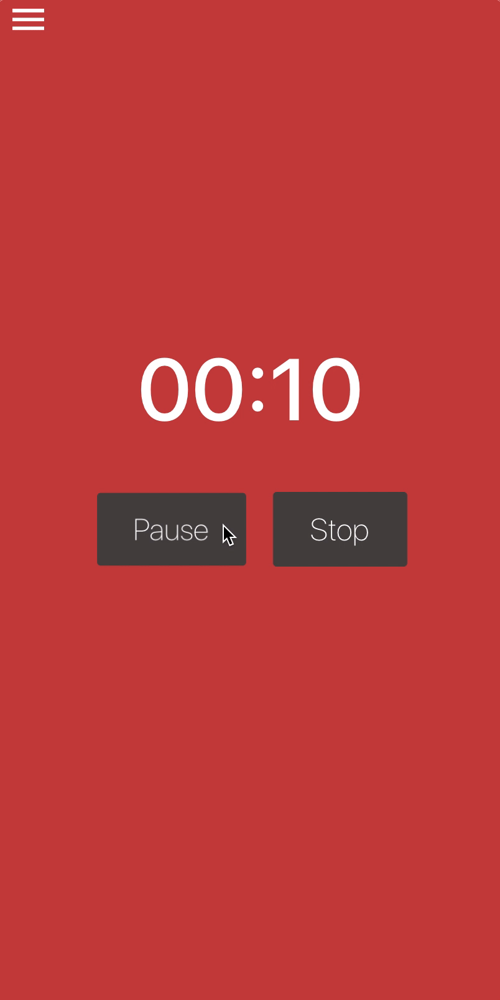

<div align="center">
  
</div>

# react-native-bouncy-touchable
[](https://npmjs.org/package/react-native-bouncy-touchable)
[](https://npmjs.org/package/react-native-bouncy-touchable)
[](https://github.com/RichardLitt/standard-readme)
[](https://npmjs.org/package/react-native-bouncy-touchable)
[](http://makeapullrequest.com)

> A bouncing touchable animated view

## Table of Contents

- [react-native-bouncy-touchable](#react-native-bouncy-touchable)
  - [Table of Contents](#table-of-contents)
  - [Install](#install)
  - [Usage](#usage)
  - [Props](#props)
  - [Credits](#credits)
  - [Contribute](#contribute)
  - [License](#license)

## Install

This project uses [node](https://nodejs.org) and [npm](https://www.npmjs.com). 

```sh
$ npm install react-native-bouncy-touchable
$ # OR
$ yarn add react-native-bouncy-touchable
```

## Usage

```js
export default class Button extends Component {

    render () {
      return (
            <BouncyView 
                delay={60} // Animation delay in miliseconds
                scale={1.1} // Max scale of animation
                style={styles.button} 
                onPress={this.props.onPress}
            >
              <Text style={styles.buttonText}>
                {this.props.children}
              </Text>
            </BouncyView>
      )
    }
  }
```

## Props

<table width="80%">
    <tr>
        <th>Property</th>
        <th>Type</th>
        <th>Description</th>
        <th>Default Value</th>
    </tr>
    <tr>
        <td><code>onPress</code></td>
        <td><code>function</code></td>
        <td>Function called when user taps the view area</td>
        <td><code>noop</code></td>
    </tr>
    <tr>
        <td><code>scale</code></td>
        <td><code>number</code></td>
        <td>Max scale of animation</td>
        <td><code>1.1</code></td>
    </tr>
    <tr>
        <td><code>delay</code></td>
        <td><code>float</code></td>
        <td>Animation delay in miliseconds</td>
        <td><code>40</code></td>
    </tr>
    <tr>
        <td><code>moveSlop</code></td>
        <td><code>number</code></td>
        <td>Slop area for press</td>
        <td><code>15</code></td>
    </tr>
    <tr>
        <td><code>style</code></td>
        <td><code>object</code></td>
        <td>Custom style for the component</td>
        <td><code>{}</code></td>
    </tr>
</table>

## Credits

Heavily based on [react-native-bounceable](https://github.com/slavik0329/react-native-bounceable)

## Contribute

1. Fork it and create your feature branch: `git checkout -b my-new-feature`
2. Commit your changes: `git commit -am "Add some feature"`
3. Push to the branch: `git push origin my-new-feature`
4. Submit a pull request

## License

MIT
    